# ER Coffeelab — Database ERD

**Version:** 1.1 · **Date:** June 5, 2026  
**Database:** PostgreSQL  
**Conventions:** `BIGSERIAL` PKs · `VARCHAR` for all status/type fields (no enums) · `TIMESTAMPTZ` timestamps  
**Changes from v1.0:** Added 17 POS tables (Moka POS replacement), updated `orders` and `branches` tables

---

## Table of Contents

1. [ER Diagram](#1-er-diagram)
2. [Table Definitions](#2-table-definitions)
   - 2.1 [Auth & Users](#21-auth--users) — `admins`, `branches`, `branch_admins`, `customers`, `customer_addresses`
   - 2.2 [Employees & Shifts (POS)](#22-employees--shifts-pos) — `employees`, `shifts`, `cash_movements`, `employee_attendances`
   - 2.3 [Menu & Catalog](#23-menu--catalog) — `categories`, `products`, `product_customization_groups`, `product_customization_options`
   - 2.4 [Branch Stock & Table](#24-branch-stock--table) — `branch_product_stock`, `branch_option_stock`, `store_tables`
   - 2.5 [Inventory & Procurement (POS)](#25-inventory--procurement-pos) — `ingredients`, `product_recipes`, `ingredient_stock`, `stock_movements`, `suppliers`, `purchase_orders`, `purchase_order_items`, `stock_opnames`, `stock_opname_items`
   - 2.6 [Cart](#26-cart) — `carts`, `cart_items`, `cart_item_options`
   - 2.7 [Orders](#27-orders) — `orders`, `order_items`, `order_item_options`, `order_status_logs`, `refunds`
   - 2.8 [Payment](#28-payment) — `payment_methods`, `payment_instructions`, `payment_logs`
   - 2.9 [Promo & Voucher](#29-promo--voucher) — `campaigns`, `vouchers`, `voucher_redemptions`, `discounts`
   - 2.10 [Loyalty Program](#210-loyalty-program) — `loyalty_tiers`, `loyalty_transactions`, `daily_checkins`
   - 2.11 [Engagement & Content](#211-engagement--content) — `customer_favorites`, `banners`, `static_pages`, `merchandise`
   - 2.12 [Notification](#212-notification) — `notification_templates`, `notification_logs`
   - 2.13 [Configuration (POS)](#213-configuration-pos) — `tax_configs`
3. [Indexes & Optimization](#3-indexes--optimization)
4. [Seed Data](#4-seed-data)
5. [Static Value Reference (for FE)](#5-static-value-reference-for-fe)

---

## 1. ER Diagram

```mermaid
erDiagram
    %% ── Auth & Users ──
    admins { bigserial id PK }
    branches { bigserial id PK }
    branch_admins { bigserial id PK }
    customers { bigserial id PK }
    customer_addresses { bigserial id PK }

    %% ── Employees & Shifts (POS) ──
    employees { bigserial id PK }
    shifts { bigserial id PK }
    cash_movements { bigserial id PK }
    employee_attendances { bigserial id PK }

    %% ── Menu ──
    categories { bigserial id PK }
    products { bigserial id PK }
    product_customization_groups { bigserial id PK }
    product_customization_options { bigserial id PK }

    %% ── Branch Stock & Tables ──
    branch_product_stock { bigserial id PK }
    branch_option_stock { bigserial id PK }
    store_tables { bigserial id PK }

    %% ── Inventory (POS) ──
    ingredients { bigserial id PK }
    product_recipes { bigserial id PK }
    ingredient_stock { bigserial id PK }
    stock_movements { bigserial id PK }
    suppliers { bigserial id PK }
    purchase_orders { bigserial id PK }
    purchase_order_items { bigserial id PK }
    stock_opnames { bigserial id PK }
    stock_opname_items { bigserial id PK }

    %% ── Cart ──
    carts { bigserial id PK }
    cart_items { bigserial id PK }
    cart_item_options { bigserial id PK }

    %% ── Orders ──
    orders { bigserial id PK }
    order_items { bigserial id PK }
    order_item_options { bigserial id PK }
    order_status_logs { bigserial id PK }
    refunds { bigserial id PK }

    %% ── Payment ──
    payment_methods { bigserial id PK }
    payment_instructions { bigserial id PK }
    payment_logs { bigserial id PK }

    %% ── Promo ──
    campaigns { bigserial id PK }
    vouchers { bigserial id PK }
    voucher_redemptions { bigserial id PK }
    discounts { bigserial id PK }

    %% ── Loyalty ──
    loyalty_tiers { bigserial id PK }
    loyalty_transactions { bigserial id PK }
    daily_checkins { bigserial id PK }

    %% ── Content ──
    customer_favorites { bigserial id PK }
    banners { bigserial id PK }
    static_pages { bigserial id PK }
    merchandise { bigserial id PK }

    %% ── Notification ──
    notification_templates { bigserial id PK }
    notification_logs { bigserial id PK }

    %% ── Config ──
    tax_configs { bigserial id PK }

    %% ═══ RELATIONSHIPS ═══
    admins ||--o{ branch_admins : "assigned to"
    branches ||--o{ branch_admins : "staffed by"
    branches ||--o{ employees : "works at"
    branches ||--o{ shifts : "has shifts"
    branches ||--o{ store_tables : "has tables"
    branches ||--o{ branch_product_stock : "tracks"
    branches ||--o{ branch_option_stock : "tracks"
    branches ||--o{ ingredient_stock : "stores"
    branches ||--o{ stock_movements : "logs"
    branches ||--o{ stock_opnames : "counts at"
    branches ||--o{ purchase_orders : "receives"
    branches ||--o{ carts : "selected store"
    branches ||--o{ orders : "fulfills"
    branches ||--o{ tax_configs : "taxed"

    employees ||--o{ shifts : "opens"
    employees ||--o{ orders : "serves"
    employees ||--o{ employee_attendances : "clocks"
    shifts ||--o{ cash_movements : "cash flow"
    shifts ||--o{ orders : "during shift"

    categories ||--o{ products : "contains"
    products ||--o{ product_customization_groups : "has groups"
    products ||--o{ product_recipes : "made from"
    products ||--o{ branch_product_stock : "stocked at"
    products ||--o{ customer_favorites : "favorited"
    products ||--o{ cart_items : "in cart"
    products ||--o{ order_items : "ordered"
    product_customization_groups ||--o{ product_customization_options : "has options"
    product_customization_options ||--o{ branch_option_stock : "stocked at"
    product_customization_options ||--o{ cart_item_options : "selected"
    product_customization_options ||--o{ order_item_options : "selected"

    ingredients ||--o{ product_recipes : "used in"
    ingredients ||--o{ ingredient_stock : "stocked"
    ingredients ||--o{ stock_movements : "moved"
    ingredients ||--o{ stock_opname_items : "counted"
    ingredients ||--o{ purchase_order_items : "purchased"
    suppliers ||--o{ purchase_orders : "supplies"
    purchase_orders ||--o{ purchase_order_items : "contains"
    stock_opnames ||--o{ stock_opname_items : "contains"

    loyalty_tiers ||--o{ customers : "current tier"
    customers ||--o{ customer_addresses : "has addresses"
    customers ||--o{ carts : "owns cart"
    customers ||--o{ orders : "places"
    customers ||--o{ voucher_redemptions : "redeems"
    customers ||--o{ loyalty_transactions : "earns/spends"
    customers ||--o{ daily_checkins : "checks in"
    customers ||--o{ customer_favorites : "favorites"

    carts ||--o{ cart_items : "contains"
    cart_items ||--o{ cart_item_options : "customized"

    orders ||--o{ order_items : "contains"
    orders ||--o{ order_status_logs : "tracked"
    orders ||--o{ refunds : "refunded"
    orders ||--o{ voucher_redemptions : "applied"
    orders ||--o{ loyalty_transactions : "earns"
    order_items ||--o{ order_item_options : "customized"
    customer_addresses ||--o{ orders : "delivered to"
    store_tables ||--o{ orders : "seated at"
    discounts ||--o{ orders : "applied"

    vouchers }o--|| campaigns : "belongs to"
    vouchers ||--o{ voucher_redemptions : "used in"

    payment_methods ||--o{ payment_instructions : "has steps"
    notification_templates ||--o{ notification_logs : "sends"
```



---

## 2. Table Definitions

### 2.1 Auth & Users

#### `admins`

```sql
CREATE TABLE admins (
    id              BIGSERIAL       PRIMARY KEY,
    name            VARCHAR(100)    NOT NULL,
    email           VARCHAR(150)    NOT NULL UNIQUE,
    password_hash   VARCHAR(255)    NOT NULL,
    role            VARCHAR(50)     DEFAULT 'SUPERADMIN',   -- SUPERADMIN | STORE_ADMIN
    status          VARCHAR(20)     DEFAULT 'ACTIVE',       -- ACTIVE | INACTIVE
    created_at      TIMESTAMPTZ     DEFAULT CURRENT_TIMESTAMP
);
```

#### `branches`

**Updated from v1.0:** Added `tax_rate`, `service_charge_pct` for POS tax configuration defaults.

```sql
CREATE TABLE branches (
    id                  BIGSERIAL       PRIMARY KEY,
    name                VARCHAR(150)    NOT NULL,
    address             TEXT            NOT NULL,
    latitude            NUMERIC(10,7)   NOT NULL,
    longitude           NUMERIC(10,7)   NOT NULL,
    phone               VARCHAR(20),
    image_url           VARCHAR(500),
    operating_hours     VARCHAR(255),
    status              VARCHAR(20)     DEFAULT 'OPEN',     -- OPEN | CLOSED | TEMPORARY_CLOSED
    pickup_enabled      BOOLEAN         DEFAULT TRUE,
    delivery_enabled    BOOLEAN         DEFAULT TRUE,
    dinein_enabled      BOOLEAN         DEFAULT FALSE,
    delivery_radius_km  NUMERIC(5,2)    DEFAULT 5.00,
    tax_rate            NUMERIC(5,2)    DEFAULT 0.00,       -- PB1 tax % (POS)
    service_charge_pct  NUMERIC(5,2)    DEFAULT 0.00,       -- service charge % (POS)
    sort_order          INTEGER         DEFAULT 0,
    created_at          TIMESTAMPTZ     DEFAULT CURRENT_TIMESTAMP
);
```

#### `branch_admins`

```sql
CREATE TABLE branch_admins (
    id          BIGSERIAL   PRIMARY KEY,
    branch_id   BIGINT      NOT NULL REFERENCES branches(id) ON DELETE CASCADE,
    admin_id    BIGINT      NOT NULL REFERENCES admins(id) ON DELETE CASCADE,
    created_at  TIMESTAMPTZ DEFAULT CURRENT_TIMESTAMP,
    UNIQUE (branch_id, admin_id)
);
```

#### `customers`

```sql
CREATE TABLE customers (
    id              BIGSERIAL       PRIMARY KEY,
    name            VARCHAR(100)    NOT NULL,
    email           VARCHAR(150),
    phone           VARCHAR(20)     NOT NULL UNIQUE,
    password_hash   VARCHAR(255),
    avatar_url      VARCHAR(500),
    auth_provider   VARCHAR(20)     DEFAULT 'PHONE',
    status          VARCHAR(20)     DEFAULT 'ACTIVE',
    loyalty_tier_id BIGINT,
    total_points    BIGINT          DEFAULT 0,
    lifetime_spend  BIGINT          DEFAULT 0,
    created_at      TIMESTAMPTZ     DEFAULT CURRENT_TIMESTAMP
);
```

#### `customer_addresses`

```sql
CREATE TABLE customer_addresses (
    id              BIGSERIAL       PRIMARY KEY,
    customer_id     BIGINT          NOT NULL REFERENCES customers(id) ON DELETE CASCADE,
    label           VARCHAR(50)     NOT NULL,
    address         TEXT            NOT NULL,
    latitude        NUMERIC(10,7),
    longitude       NUMERIC(10,7),
    notes           VARCHAR(255),
    is_default      BOOLEAN         DEFAULT FALSE,
    created_at      TIMESTAMPTZ     DEFAULT CURRENT_TIMESTAMP
);
```

---

### 2.2 Employees & Shifts (POS)

#### `employees`

Staff members who operate the POS terminal (baristas, cashiers, shift leads). Separate from `admins` because they use PIN login on the POS device, not email/password on the admin panel.

```sql
CREATE TABLE employees (
    id              BIGSERIAL       PRIMARY KEY,
    branch_id       BIGINT          NOT NULL REFERENCES branches(id) ON DELETE CASCADE,
    name            VARCHAR(100)    NOT NULL,
    phone           VARCHAR(20),
    email           VARCHAR(150),
    pin_hash        VARCHAR(255)    NOT NULL,       -- 4-6 digit PIN for POS login
    role            VARCHAR(50)     DEFAULT 'BARISTA',  -- BARISTA | CASHIER | SHIFT_LEAD | MANAGER
    hourly_rate     BIGINT          DEFAULT 0,      -- IDR per hour (for labor cost tracking)
    avatar_url      VARCHAR(500),
    status          VARCHAR(20)     DEFAULT 'ACTIVE',   -- ACTIVE | INACTIVE
    created_at      TIMESTAMPTZ     DEFAULT CURRENT_TIMESTAMP
);
```

#### `shifts`

Shift open/close with cash reconciliation.

```sql
CREATE TABLE shifts (
    id              BIGSERIAL       PRIMARY KEY,
    branch_id       BIGINT          NOT NULL REFERENCES branches(id) ON DELETE CASCADE,
    employee_id     BIGINT          NOT NULL REFERENCES employees(id) ON DELETE RESTRICT,
    opened_at       TIMESTAMPTZ     NOT NULL DEFAULT CURRENT_TIMESTAMP,
    closed_at       TIMESTAMPTZ,
    opening_cash    BIGINT          NOT NULL DEFAULT 0,     -- cash in drawer at shift start
    expected_cash   BIGINT          DEFAULT 0,              -- system-calculated expected cash
    actual_cash     BIGINT,                                 -- manually counted cash at close
    cash_difference BIGINT,                                 -- actual - expected (surplus/shortage)
    total_sales     BIGINT          DEFAULT 0,
    total_orders    INTEGER         DEFAULT 0,
    total_refunds   BIGINT          DEFAULT 0,
    notes           TEXT,
    status          VARCHAR(20)     DEFAULT 'OPEN',         -- OPEN | CLOSED
    created_at      TIMESTAMPTZ     DEFAULT CURRENT_TIMESTAMP
);
```

#### `cash_movements`

Cash in/out transactions during a shift (petty cash, deposits, tips, etc.).

```sql
CREATE TABLE cash_movements (
    id              BIGSERIAL       PRIMARY KEY,
    shift_id        BIGINT          NOT NULL REFERENCES shifts(id) ON DELETE CASCADE,
    employee_id     BIGINT          NOT NULL REFERENCES employees(id) ON DELETE RESTRICT,
    type            VARCHAR(20)     NOT NULL,       -- CASH_IN | CASH_OUT
    amount          BIGINT          NOT NULL,
    reason          VARCHAR(255)    NOT NULL,       -- e.g. "Petty cash for milk supply", "Bank deposit"
    created_at      TIMESTAMPTZ     DEFAULT CURRENT_TIMESTAMP
);
```

#### `employee_attendances`

Clock in/out records for labor tracking.

```sql
CREATE TABLE employee_attendances (
    id              BIGSERIAL       PRIMARY KEY,
    employee_id     BIGINT          NOT NULL REFERENCES employees(id) ON DELETE CASCADE,
    branch_id       BIGINT          NOT NULL REFERENCES branches(id) ON DELETE CASCADE,
    clock_in        TIMESTAMPTZ     NOT NULL,
    clock_out       TIMESTAMPTZ,
    total_hours     NUMERIC(5,2),                   -- calculated on clock out
    notes           VARCHAR(255),
    created_at      TIMESTAMPTZ     DEFAULT CURRENT_TIMESTAMP
);
```

---

### 2.3 Menu & Catalog

#### `categories`

```sql
CREATE TABLE categories (
    id          BIGSERIAL       PRIMARY KEY,
    name        VARCHAR(100)    NOT NULL,
    icon_url    VARCHAR(500),
    sort_order  INTEGER         DEFAULT 0,
    status      VARCHAR(20)     DEFAULT 'ACTIVE'
);
```

#### `products`

```sql
CREATE TABLE products (
    id                  BIGSERIAL       PRIMARY KEY,
    category_id         BIGINT          NOT NULL REFERENCES categories(id) ON DELETE RESTRICT,
    name                VARCHAR(200)    NOT NULL,
    description         TEXT,
    image_url           VARCHAR(500),
    sku                 VARCHAR(50),                        -- barcode/SKU for POS scanner
    base_price          BIGINT          NOT NULL,
    cost_price          BIGINT          DEFAULT 0,          -- COGS for profit tracking (POS)
    sweetness_level     INTEGER         DEFAULT 0,
    creaminess_level    INTEGER         DEFAULT 0,
    badge               VARCHAR(30),
    temp_options        VARCHAR(20)     DEFAULT 'BOTH',
    points_earned       INTEGER         DEFAULT 0,
    is_pos_only         BOOLEAN         DEFAULT FALSE,      -- visible only on POS, not customer app
    status              VARCHAR(20)     DEFAULT 'ACTIVE',
    sort_order          INTEGER         DEFAULT 0,
    created_at          TIMESTAMPTZ     DEFAULT CURRENT_TIMESTAMP
);
```

#### `product_customization_groups`

```sql
CREATE TABLE product_customization_groups (
    id              BIGSERIAL       PRIMARY KEY,
    product_id      BIGINT          NOT NULL REFERENCES products(id) ON DELETE CASCADE,
    name            VARCHAR(100)    NOT NULL,
    selection_type  VARCHAR(20)     DEFAULT 'SINGLE',
    max_selections  INTEGER         DEFAULT 1,
    is_required     BOOLEAN         DEFAULT TRUE,
    sort_order      INTEGER         DEFAULT 0
);
```

#### `product_customization_options`

```sql
CREATE TABLE product_customization_options (
    id                  BIGSERIAL       PRIMARY KEY,
    group_id            BIGINT          NOT NULL REFERENCES product_customization_groups(id) ON DELETE CASCADE,
    name                VARCHAR(100)    NOT NULL,
    additional_price    BIGINT          DEFAULT 0,
    status              VARCHAR(20)     DEFAULT 'AVAILABLE',
    sort_order          INTEGER         DEFAULT 0
);
```

---

### 2.4 Branch Stock & Table

#### `branch_product_stock`

```sql
CREATE TABLE branch_product_stock (
    id              BIGSERIAL       PRIMARY KEY,
    branch_id       BIGINT          NOT NULL REFERENCES branches(id) ON DELETE CASCADE,
    product_id      BIGINT          NOT NULL REFERENCES products(id) ON DELETE CASCADE,
    stock_status    VARCHAR(20)     DEFAULT 'AVAILABLE',
    updated_at      TIMESTAMPTZ     DEFAULT CURRENT_TIMESTAMP,
    UNIQUE (branch_id, product_id)
);
```

#### `branch_option_stock`

```sql
CREATE TABLE branch_option_stock (
    id              BIGSERIAL       PRIMARY KEY,
    branch_id       BIGINT          NOT NULL REFERENCES branches(id) ON DELETE CASCADE,
    option_id       BIGINT          NOT NULL REFERENCES product_customization_options(id) ON DELETE CASCADE,
    stock_status    VARCHAR(20)     DEFAULT 'AVAILABLE',
    updated_at      TIMESTAMPTZ     DEFAULT CURRENT_TIMESTAMP,
    UNIQUE (branch_id, option_id)
);
```

#### `store_tables`

Physical tables in dine-in branches for table management and POS table map.

```sql
CREATE TABLE store_tables (
    id              BIGSERIAL       PRIMARY KEY,
    branch_id       BIGINT          NOT NULL REFERENCES branches(id) ON DELETE CASCADE,
    table_number    VARCHAR(20)     NOT NULL,
    section         VARCHAR(50),                    -- e.g. "Indoor", "Outdoor", "Smoking"
    capacity        INTEGER         DEFAULT 4,
    pos_x           INTEGER         DEFAULT 0,      -- x position on floor plan
    pos_y           INTEGER         DEFAULT 0,      -- y position on floor plan
    status          VARCHAR(20)     DEFAULT 'AVAILABLE', -- AVAILABLE | OCCUPIED | RESERVED | INACTIVE
    current_order_id BIGINT,                        -- FK set when occupied
    occupied_since  TIMESTAMPTZ,
    sort_order      INTEGER         DEFAULT 0,
    UNIQUE (branch_id, table_number)
);
```

---

### 2.5 Inventory & Procurement (POS)

#### `ingredients`

Raw materials used across products (coffee beans, milk, syrup, cups, etc.).

```sql
CREATE TABLE ingredients (
    id              BIGSERIAL       PRIMARY KEY,
    name            VARCHAR(200)    NOT NULL,
    sku             VARCHAR(50),
    unit            VARCHAR(20)     NOT NULL,       -- g | ml | pcs | kg | l
    cost_per_unit   BIGINT          DEFAULT 0,      -- IDR
    min_stock_alert NUMERIC(10,2)   DEFAULT 0,      -- low-stock threshold
    category        VARCHAR(50),                    -- COFFEE_BEAN | DAIRY | SYRUP | CUP | TOPPING | FOOD_SUPPLY | OTHER
    status          VARCHAR(20)     DEFAULT 'ACTIVE',
    created_at      TIMESTAMPTZ     DEFAULT CURRENT_TIMESTAMP
);
```

#### `product_recipes`

Bill of materials: which ingredients (and how much) are needed to make one serving of a product.

```sql
CREATE TABLE product_recipes (
    id              BIGSERIAL       PRIMARY KEY,
    product_id      BIGINT          NOT NULL REFERENCES products(id) ON DELETE CASCADE,
    ingredient_id   BIGINT          NOT NULL REFERENCES ingredients(id) ON DELETE CASCADE,
    quantity_used   NUMERIC(10,3)   NOT NULL,       -- amount per serving
    unit            VARCHAR(20)     NOT NULL,       -- same unit as ingredient
    UNIQUE (product_id, ingredient_id)
);
```

#### `ingredient_stock`

Current stock level per ingredient per branch.

```sql
CREATE TABLE ingredient_stock (
    id              BIGSERIAL       PRIMARY KEY,
    branch_id       BIGINT          NOT NULL REFERENCES branches(id) ON DELETE CASCADE,
    ingredient_id   BIGINT          NOT NULL REFERENCES ingredients(id) ON DELETE CASCADE,
    current_stock   NUMERIC(10,3)   NOT NULL DEFAULT 0,
    unit            VARCHAR(20)     NOT NULL,
    updated_at      TIMESTAMPTZ     DEFAULT CURRENT_TIMESTAMP,
    UNIQUE (branch_id, ingredient_id)
);
```

#### `stock_movements`

All stock-in/out/waste/adjustment/transfer events.

```sql
CREATE TABLE stock_movements (
    id                  BIGSERIAL       PRIMARY KEY,
    branch_id           BIGINT          NOT NULL REFERENCES branches(id) ON DELETE CASCADE,
    ingredient_id       BIGINT          NOT NULL REFERENCES ingredients(id) ON DELETE CASCADE,
    type                VARCHAR(30)     NOT NULL,   -- PURCHASE_IN | USAGE | WASTE | ADJUSTMENT | TRANSFER_IN | TRANSFER_OUT
    quantity            NUMERIC(10,3)   NOT NULL,   -- positive for in, negative for out
    unit                VARCHAR(20)     NOT NULL,
    stock_before        NUMERIC(10,3),
    stock_after         NUMERIC(10,3),
    reference_type      VARCHAR(30),                -- PURCHASE_ORDER | ORDER | STOCK_OPNAME | MANUAL
    reference_id        BIGINT,
    notes               VARCHAR(255),
    employee_id         BIGINT          REFERENCES employees(id) ON DELETE SET NULL,
    created_at          TIMESTAMPTZ     DEFAULT CURRENT_TIMESTAMP
);
```

#### `suppliers`

```sql
CREATE TABLE suppliers (
    id              BIGSERIAL       PRIMARY KEY,
    name            VARCHAR(200)    NOT NULL,
    contact_person  VARCHAR(100),
    phone           VARCHAR(20),
    email           VARCHAR(150),
    address         TEXT,
    notes           TEXT,
    status          VARCHAR(20)     DEFAULT 'ACTIVE',
    created_at      TIMESTAMPTZ     DEFAULT CURRENT_TIMESTAMP
);
```

#### `purchase_orders`

```sql
CREATE TABLE purchase_orders (
    id              BIGSERIAL       PRIMARY KEY,
    po_number       VARCHAR(50)     NOT NULL UNIQUE,
    branch_id       BIGINT          NOT NULL REFERENCES branches(id) ON DELETE CASCADE,
    supplier_id     BIGINT          NOT NULL REFERENCES suppliers(id) ON DELETE RESTRICT,
    status          VARCHAR(20)     DEFAULT 'DRAFT',    -- DRAFT | SUBMITTED | APPROVED | RECEIVED | CANCELLED
    total_amount    BIGINT          DEFAULT 0,
    notes           TEXT,
    ordered_by      BIGINT          REFERENCES employees(id) ON DELETE SET NULL,
    approved_by     BIGINT          REFERENCES admins(id) ON DELETE SET NULL,
    received_at     TIMESTAMPTZ,
    created_at      TIMESTAMPTZ     DEFAULT CURRENT_TIMESTAMP
);
```

#### `purchase_order_items`

```sql
CREATE TABLE purchase_order_items (
    id                  BIGSERIAL       PRIMARY KEY,
    purchase_order_id   BIGINT          NOT NULL REFERENCES purchase_orders(id) ON DELETE CASCADE,
    ingredient_id       BIGINT          NOT NULL REFERENCES ingredients(id) ON DELETE RESTRICT,
    quantity_ordered    NUMERIC(10,3)   NOT NULL,
    quantity_received   NUMERIC(10,3)   DEFAULT 0,
    unit                VARCHAR(20)     NOT NULL,
    unit_price          BIGINT          NOT NULL,
    subtotal            BIGINT          NOT NULL
);
```

#### `stock_opnames`

Stock counting (stock take) header.

```sql
CREATE TABLE stock_opnames (
    id              BIGSERIAL       PRIMARY KEY,
    branch_id       BIGINT          NOT NULL REFERENCES branches(id) ON DELETE CASCADE,
    employee_id     BIGINT          NOT NULL REFERENCES employees(id) ON DELETE RESTRICT,
    status          VARCHAR(20)     DEFAULT 'IN_PROGRESS',  -- IN_PROGRESS | COMPLETED | CANCELLED
    notes           TEXT,
    completed_at    TIMESTAMPTZ,
    created_at      TIMESTAMPTZ     DEFAULT CURRENT_TIMESTAMP
);
```

#### `stock_opname_items`

Individual ingredient counts within a stock opname.

```sql
CREATE TABLE stock_opname_items (
    id                  BIGSERIAL       PRIMARY KEY,
    stock_opname_id     BIGINT          NOT NULL REFERENCES stock_opnames(id) ON DELETE CASCADE,
    ingredient_id       BIGINT          NOT NULL REFERENCES ingredients(id) ON DELETE RESTRICT,
    system_stock        NUMERIC(10,3)   NOT NULL,   -- what the system says
    actual_stock        NUMERIC(10,3)   NOT NULL,   -- what was physically counted
    difference          NUMERIC(10,3)   NOT NULL,   -- actual - system
    unit                VARCHAR(20)     NOT NULL,
    notes               VARCHAR(255)
);
```

---

### 2.6 Cart

*(Unchanged from v1.0)*

```sql
CREATE TABLE carts (
    id              BIGSERIAL       PRIMARY KEY,
    customer_id     BIGINT          NOT NULL REFERENCES customers(id) ON DELETE CASCADE,
    branch_id       BIGINT          REFERENCES branches(id) ON DELETE SET NULL,
    order_mode      VARCHAR(20),
    updated_at      TIMESTAMPTZ     DEFAULT CURRENT_TIMESTAMP,
    UNIQUE (customer_id)
);

CREATE TABLE cart_items (
    id              BIGSERIAL       PRIMARY KEY,
    cart_id         BIGINT          NOT NULL REFERENCES carts(id) ON DELETE CASCADE,
    product_id      BIGINT          NOT NULL REFERENCES products(id) ON DELETE CASCADE,
    quantity        INTEGER         NOT NULL DEFAULT 1,
    unit_price      BIGINT          NOT NULL,
    notes           VARCHAR(255)
);

CREATE TABLE cart_item_options (
    id                  BIGSERIAL   PRIMARY KEY,
    cart_item_id        BIGINT      NOT NULL REFERENCES cart_items(id) ON DELETE CASCADE,
    option_id           BIGINT      NOT NULL REFERENCES product_customization_options(id) ON DELETE CASCADE,
    additional_price    BIGINT      DEFAULT 0
);
```

---

### 2.7 Orders

#### `orders`

**Updated from v1.0:** Added `shift_id`, `employee_id`, `table_id`, `tax_amount`, `service_charge`, `discount_id`, `is_pos`, `receipt_number` for POS support.

```sql
CREATE TABLE orders (
    id                      BIGSERIAL       PRIMARY KEY,
    invoice_code            VARCHAR(50)     NOT NULL UNIQUE,
    receipt_number          VARCHAR(50),                        -- POS receipt # (e.g. #001 per shift)
    customer_id             BIGINT          REFERENCES customers(id) ON DELETE SET NULL,  -- nullable for walk-in POS
    branch_id               BIGINT          NOT NULL REFERENCES branches(id) ON DELETE RESTRICT,
    order_mode              VARCHAR(20)     NOT NULL,           -- PICKUP | DELIVERY | DINEIN | POS_COUNTER
    order_source            VARCHAR(20)     DEFAULT 'APP',      -- APP | POS
    status                  VARCHAR(30)     DEFAULT 'PENDING',
    subtotal                BIGINT          NOT NULL,
    discount_amount         BIGINT          DEFAULT 0,
    discount_id             BIGINT,                             -- FK to discounts if POS preset used
    tax_amount              BIGINT          DEFAULT 0,          -- PB1 (POS)
    service_charge          BIGINT          DEFAULT 0,          -- service charge (POS)
    delivery_fee            BIGINT          DEFAULT 0,
    bag_fee                 BIGINT          DEFAULT 0,
    total_amount            BIGINT          NOT NULL,
    points_earned           BIGINT          DEFAULT 0,
    voucher_id              BIGINT,
    payment_method_code     VARCHAR(50),
    payment_reference       VARCHAR(255),
    delivery_address_id     BIGINT          REFERENCES customer_addresses(id) ON DELETE SET NULL,
    table_id                BIGINT,                             -- FK to store_tables (POS dine-in)
    table_number            VARCHAR(10),
    shift_id                BIGINT,                             -- FK to shifts (POS)
    employee_id             BIGINT          REFERENCES employees(id) ON DELETE SET NULL, -- served/cashier (POS)
    is_pos                  BOOLEAN         DEFAULT FALSE,      -- true = POS terminal order
    scheduled_at            TIMESTAMPTZ,
    cancel_reason           TEXT,
    paid_at                 TIMESTAMPTZ,
    completed_at            TIMESTAMPTZ,
    created_at              TIMESTAMPTZ     DEFAULT CURRENT_TIMESTAMP
);
```

*Note: `voucher_id`, `discount_id`, `table_id`, `shift_id` FK constraints are added via ALTER TABLE after the referenced tables are created.*

#### `order_items`

```sql
CREATE TABLE order_items (
    id              BIGSERIAL       PRIMARY KEY,
    order_id        BIGINT          NOT NULL REFERENCES orders(id) ON DELETE CASCADE,
    product_id      BIGINT          REFERENCES products(id) ON DELETE SET NULL,
    product_name    VARCHAR(200)    NOT NULL,
    unit_price      BIGINT          NOT NULL,
    quantity        INTEGER         NOT NULL DEFAULT 1,
    subtotal        BIGINT          NOT NULL,
    discount_amount BIGINT          DEFAULT 0,      -- item-level discount (POS)
    notes           VARCHAR(255)
);
```

#### `order_item_options`

```sql
CREATE TABLE order_item_options (
    id                  BIGSERIAL       PRIMARY KEY,
    order_item_id       BIGINT          NOT NULL REFERENCES order_items(id) ON DELETE CASCADE,
    option_id           BIGINT          REFERENCES product_customization_options(id) ON DELETE SET NULL,
    option_group_name   VARCHAR(100)    NOT NULL,
    option_name         VARCHAR(100)    NOT NULL,
    additional_price    BIGINT          DEFAULT 0
);
```

#### `order_status_logs`

```sql
CREATE TABLE order_status_logs (
    id          BIGSERIAL       PRIMARY KEY,
    order_id    BIGINT          NOT NULL REFERENCES orders(id) ON DELETE CASCADE,
    status      VARCHAR(30)     NOT NULL,
    actor_type  VARCHAR(20),        -- SYSTEM | ADMIN | CUSTOMER | COURIER | EMPLOYEE
    actor_id    BIGINT,
    notes       VARCHAR(255),
    created_at  TIMESTAMPTZ     DEFAULT CURRENT_TIMESTAMP
);
```

#### `refunds`

Refund and void records for POS and app orders.

```sql
CREATE TABLE refunds (
    id              BIGSERIAL       PRIMARY KEY,
    order_id        BIGINT          NOT NULL REFERENCES orders(id) ON DELETE RESTRICT,
    shift_id        BIGINT          REFERENCES shifts(id) ON DELETE SET NULL,
    refund_type     VARCHAR(20)     NOT NULL,       -- FULL | PARTIAL | VOID
    refund_amount   BIGINT          NOT NULL,
    reason          VARCHAR(255)    NOT NULL,
    refund_method   VARCHAR(50),                    -- CASH | ORIGINAL_METHOD | STORE_CREDIT
    approved_by     BIGINT          REFERENCES admins(id) ON DELETE SET NULL,
    employee_id     BIGINT          REFERENCES employees(id) ON DELETE SET NULL,
    status          VARCHAR(20)     DEFAULT 'PENDING',  -- PENDING | APPROVED | REJECTED | PROCESSED
    created_at      TIMESTAMPTZ     DEFAULT CURRENT_TIMESTAMP
);
```

---

### 2.8 Payment

*(Unchanged from v1.0)*

```sql
CREATE TABLE payment_methods (
    id              BIGSERIAL       PRIMARY KEY,
    code            VARCHAR(50)     NOT NULL UNIQUE,
    name            VARCHAR(100)    NOT NULL,
    logo_url        VARCHAR(500),
    type            VARCHAR(50)     NOT NULL,
    provider        VARCHAR(50)     NOT NULL,
    admin_fee_flat  BIGINT          DEFAULT 0,
    admin_fee_pct   NUMERIC(5,2)    DEFAULT 0.00,
    is_active       BOOLEAN         DEFAULT TRUE,
    is_redirect     BOOLEAN         DEFAULT FALSE,
    sort_order      INTEGER         DEFAULT 0
);

CREATE TABLE payment_instructions (
    id                  BIGSERIAL       PRIMARY KEY,
    payment_method_id   BIGINT          NOT NULL REFERENCES payment_methods(id) ON DELETE CASCADE,
    title               VARCHAR(255)    NOT NULL,
    content             TEXT            NOT NULL,
    sort_order          INTEGER         DEFAULT 0,
    created_at          TIMESTAMPTZ     DEFAULT CURRENT_TIMESTAMP
);

CREATE TABLE payment_logs (
    id                  BIGSERIAL       PRIMARY KEY,
    invoice_code        VARCHAR(50)     NOT NULL,
    endpoint            VARCHAR(255),
    type                VARCHAR(50),
    request_payload     TEXT,
    response_payload    TEXT,
    http_status         INTEGER,
    created_at          TIMESTAMPTZ     DEFAULT CURRENT_TIMESTAMP
);
```

---

### 2.9 Promo & Voucher

#### `campaigns`

```sql
CREATE TABLE campaigns (
    id              BIGSERIAL       PRIMARY KEY,
    name            VARCHAR(200)    NOT NULL,
    description     TEXT,
    image_url       VARCHAR(500),
    status          VARCHAR(20)     DEFAULT 'ACTIVE',
    start_date      TIMESTAMPTZ     NOT NULL,
    end_date        TIMESTAMPTZ     NOT NULL,
    created_at      TIMESTAMPTZ     DEFAULT CURRENT_TIMESTAMP
);
```

#### `vouchers`

```sql
CREATE TABLE vouchers (
    id                  BIGSERIAL       PRIMARY KEY,
    campaign_id         BIGINT          REFERENCES campaigns(id) ON DELETE SET NULL,
    code                VARCHAR(50)     NOT NULL UNIQUE,
    discount_type       VARCHAR(20)     NOT NULL,
    discount_value      BIGINT          NOT NULL,
    max_discount        BIGINT,
    min_transaction     BIGINT          DEFAULT 0,
    usage_quota         INTEGER,
    used_count          INTEGER         DEFAULT 0,
    target_audience     VARCHAR(30)     DEFAULT 'ALL',
    target_tier         VARCHAR(30),
    status              VARCHAR(20)     DEFAULT 'ACTIVE',
    start_date          TIMESTAMPTZ     NOT NULL,
    end_date            TIMESTAMPTZ     NOT NULL,
    created_at          TIMESTAMPTZ     DEFAULT CURRENT_TIMESTAMP
);
```

#### `voucher_redemptions`

```sql
CREATE TABLE voucher_redemptions (
    id                  BIGSERIAL       PRIMARY KEY,
    voucher_id          BIGINT          NOT NULL REFERENCES vouchers(id) ON DELETE RESTRICT,
    customer_id         BIGINT          NOT NULL REFERENCES customers(id) ON DELETE RESTRICT,
    order_id            BIGINT          NOT NULL REFERENCES orders(id) ON DELETE RESTRICT,
    discount_applied    BIGINT          NOT NULL,
    created_at          TIMESTAMPTZ     DEFAULT CURRENT_TIMESTAMP
);
```

#### `discounts`

**New (POS):** Preset discount configurations for POS cashier use.

```sql
CREATE TABLE discounts (
    id              BIGSERIAL       PRIMARY KEY,
    name            VARCHAR(100)    NOT NULL,
    discount_type   VARCHAR(20)     NOT NULL,       -- PERCENTAGE | FIXED
    discount_value  BIGINT          NOT NULL,
    max_discount    BIGINT,
    apply_to        VARCHAR(20)     DEFAULT 'ORDER', -- ORDER | ITEM
    requires_pin    BOOLEAN         DEFAULT FALSE,   -- manager PIN required?
    status          VARCHAR(20)     DEFAULT 'ACTIVE',
    created_at      TIMESTAMPTZ     DEFAULT CURRENT_TIMESTAMP
);
```

---

### 2.10 Loyalty Program

*(Unchanged from v1.0)*

```sql
CREATE TABLE loyalty_tiers (
    id                  BIGSERIAL       PRIMARY KEY,
    name                VARCHAR(50)     NOT NULL,
    min_spend           BIGINT          NOT NULL,
    point_multiplier    NUMERIC(3,1)    DEFAULT 1.0,
    benefits            TEXT,
    sort_order          INTEGER         DEFAULT 0
);

CREATE TABLE loyalty_transactions (
    id              BIGSERIAL       PRIMARY KEY,
    customer_id     BIGINT          NOT NULL REFERENCES customers(id) ON DELETE CASCADE,
    order_id        BIGINT          REFERENCES orders(id) ON DELETE SET NULL,
    type            VARCHAR(20)     NOT NULL,
    points          BIGINT          NOT NULL,
    balance_after   BIGINT          NOT NULL,
    description     VARCHAR(255),
    created_at      TIMESTAMPTZ     DEFAULT CURRENT_TIMESTAMP
);

CREATE TABLE daily_checkins (
    id              BIGSERIAL       PRIMARY KEY,
    customer_id     BIGINT          NOT NULL REFERENCES customers(id) ON DELETE CASCADE,
    day_sequence    INTEGER         NOT NULL,
    points_awarded  BIGINT          NOT NULL,
    checkin_date    DATE            NOT NULL,
    created_at      TIMESTAMPTZ     DEFAULT CURRENT_TIMESTAMP,
    UNIQUE (customer_id, checkin_date)
);

ALTER TABLE customers ADD CONSTRAINT fk_customers_loyalty_tier
    FOREIGN KEY (loyalty_tier_id) REFERENCES loyalty_tiers(id) ON DELETE SET NULL;
```

---

### 2.11 Engagement & Content

*(Unchanged from v1.0)*

```sql
CREATE TABLE customer_favorites (
    id              BIGSERIAL   PRIMARY KEY,
    customer_id     BIGINT      NOT NULL REFERENCES customers(id) ON DELETE CASCADE,
    product_id      BIGINT      NOT NULL REFERENCES products(id) ON DELETE CASCADE,
    created_at      TIMESTAMPTZ DEFAULT CURRENT_TIMESTAMP,
    UNIQUE (customer_id, product_id)
);

CREATE TABLE banners (
    id                  BIGSERIAL       PRIMARY KEY,
    title               VARCHAR(200)    NOT NULL,
    image_url           VARCHAR(500)    NOT NULL,
    link_destination    VARCHAR(500),
    placement           VARCHAR(30)     DEFAULT 'HOME',
    sort_order          INTEGER         DEFAULT 0,
    status              VARCHAR(20)     DEFAULT 'ACTIVE',
    start_date          TIMESTAMPTZ,
    end_date            TIMESTAMPTZ
);

CREATE TABLE static_pages (
    id          BIGSERIAL       PRIMARY KEY,
    slug        VARCHAR(100)    NOT NULL UNIQUE,
    title       VARCHAR(200)    NOT NULL,
    content     TEXT            NOT NULL,
    updated_at  TIMESTAMPTZ     DEFAULT CURRENT_TIMESTAMP
);

CREATE TABLE merchandise (
    id              BIGSERIAL       PRIMARY KEY,
    name            VARCHAR(200)    NOT NULL,
    description     TEXT,
    image_url       VARCHAR(500),
    price           BIGINT          NOT NULL,
    personalizable  BOOLEAN         DEFAULT FALSE,
    badge           VARCHAR(30),
    status          VARCHAR(20)     DEFAULT 'ACTIVE',
    sort_order      INTEGER         DEFAULT 0
);
```

---

### 2.12 Notification

*(Unchanged from v1.0)*

```sql
CREATE TABLE notification_templates (
    id              BIGSERIAL       PRIMARY KEY,
    event_trigger   VARCHAR(50)     NOT NULL UNIQUE,
    channel         VARCHAR(20)     NOT NULL,
    message_content TEXT            NOT NULL,
    is_active       BOOLEAN         DEFAULT TRUE
);

CREATE TABLE notification_logs (
    id                  BIGSERIAL       PRIMARY KEY,
    template_id         BIGINT          REFERENCES notification_templates(id) ON DELETE SET NULL,
    invoice_code        VARCHAR(50),
    recipient           VARCHAR(150)    NOT NULL,
    channel             VARCHAR(20)     NOT NULL,
    request_payload     TEXT,
    response_payload    TEXT,
    status              VARCHAR(20),
    created_at          TIMESTAMPTZ     DEFAULT CURRENT_TIMESTAMP
);
```

---

### 2.13 Configuration (POS)

#### `tax_configs`

Per-branch tax and service charge overrides (supersedes branch-level defaults).

```sql
CREATE TABLE tax_configs (
    id              BIGSERIAL       PRIMARY KEY,
    branch_id       BIGINT          NOT NULL REFERENCES branches(id) ON DELETE CASCADE,
    tax_name        VARCHAR(50)     NOT NULL,       -- e.g. "PB1", "PPn"
    tax_rate        NUMERIC(5,2)    NOT NULL,       -- percentage
    is_inclusive    BOOLEAN         DEFAULT FALSE,   -- true = tax included in price
    is_active       BOOLEAN         DEFAULT TRUE,
    created_at      TIMESTAMPTZ     DEFAULT CURRENT_TIMESTAMP,
    UNIQUE (branch_id, tax_name)
);
```

---

### Deferred Foreign Keys

```sql
ALTER TABLE orders ADD CONSTRAINT fk_orders_voucher FOREIGN KEY (voucher_id) REFERENCES vouchers(id) ON DELETE SET NULL;
ALTER TABLE orders ADD CONSTRAINT fk_orders_discount FOREIGN KEY (discount_id) REFERENCES discounts(id) ON DELETE SET NULL;
ALTER TABLE orders ADD CONSTRAINT fk_orders_table FOREIGN KEY (table_id) REFERENCES store_tables(id) ON DELETE SET NULL;
ALTER TABLE orders ADD CONSTRAINT fk_orders_shift FOREIGN KEY (shift_id) REFERENCES shifts(id) ON DELETE SET NULL;
```

---

## 3. Indexes & Optimization

### 3.1 Auth & Users

```sql
CREATE INDEX idx_admins_role_status              ON admins (role, status);
CREATE INDEX idx_branch_admins_admin              ON branch_admins (admin_id);
CREATE INDEX idx_branch_admins_branch             ON branch_admins (branch_id);
CREATE INDEX idx_customers_email                  ON customers (email) WHERE email IS NOT NULL;
CREATE INDEX idx_customers_tier                   ON customers (loyalty_tier_id) WHERE loyalty_tier_id IS NOT NULL;
CREATE INDEX idx_customer_addresses_customer      ON customer_addresses (customer_id);
```

### 3.2 Employees & Shifts (POS)

```sql
CREATE INDEX idx_employees_branch               ON employees (branch_id, status);
CREATE INDEX idx_shifts_branch_status            ON shifts (branch_id, status);
CREATE INDEX idx_shifts_branch_opened            ON shifts (branch_id, opened_at DESC);
CREATE INDEX idx_cash_movements_shift            ON cash_movements (shift_id);
CREATE INDEX idx_employee_attendances_emp        ON employee_attendances (employee_id, clock_in DESC);
CREATE INDEX idx_employee_attendances_branch     ON employee_attendances (branch_id, clock_in DESC);
```

### 3.3 Menu & Catalog

```sql
CREATE INDEX idx_products_category               ON products (category_id);
CREATE INDEX idx_products_sku                    ON products (sku) WHERE sku IS NOT NULL;
CREATE INDEX idx_products_status_sort             ON products (status, sort_order) WHERE status = 'ACTIVE';
CREATE INDEX idx_products_badge                   ON products (badge) WHERE badge IS NOT NULL;
CREATE INDEX idx_pcg_product                      ON product_customization_groups (product_id);
CREATE INDEX idx_pco_group                        ON product_customization_options (group_id);
```

### 3.4 Branch Stock & Tables

```sql
CREATE INDEX idx_branch_product_stock_branch      ON branch_product_stock (branch_id, stock_status);
CREATE INDEX idx_branch_option_stock_branch        ON branch_option_stock (branch_id, stock_status);
CREATE INDEX idx_store_tables_branch_status        ON store_tables (branch_id, status);
```

### 3.5 Inventory (POS)

```sql
CREATE INDEX idx_product_recipes_product          ON product_recipes (product_id);
CREATE INDEX idx_product_recipes_ingredient       ON product_recipes (ingredient_id);
CREATE INDEX idx_ingredient_stock_branch          ON ingredient_stock (branch_id);
CREATE INDEX idx_ingredient_stock_ingredient      ON ingredient_stock (ingredient_id);
CREATE INDEX idx_ingredient_stock_low             ON ingredient_stock (branch_id, current_stock) WHERE current_stock > 0;
CREATE INDEX idx_stock_movements_branch_ing       ON stock_movements (branch_id, ingredient_id, created_at DESC);
CREATE INDEX idx_stock_movements_type             ON stock_movements (type, created_at DESC);
CREATE INDEX idx_purchase_orders_branch           ON purchase_orders (branch_id, status);
CREATE INDEX idx_purchase_orders_supplier         ON purchase_orders (supplier_id);
CREATE INDEX idx_purchase_order_items_po          ON purchase_order_items (purchase_order_id);
CREATE INDEX idx_stock_opnames_branch             ON stock_opnames (branch_id, created_at DESC);
CREATE INDEX idx_stock_opname_items_opname        ON stock_opname_items (stock_opname_id);
```

### 3.6 Cart

```sql
CREATE INDEX idx_cart_items_cart                  ON cart_items (cart_id);
CREATE INDEX idx_cart_item_options_item           ON cart_item_options (cart_item_id);
```

### 3.7 Orders

```sql
CREATE INDEX idx_orders_customer                 ON orders (customer_id, created_at DESC);
CREATE INDEX idx_orders_branch                   ON orders (branch_id, created_at DESC);
CREATE INDEX idx_orders_status                   ON orders (status) WHERE status NOT IN ('COMPLETED', 'CANCELLED');
CREATE INDEX idx_orders_mode_status              ON orders (order_mode, status);
CREATE INDEX idx_orders_invoice                  ON orders (invoice_code);
CREATE INDEX idx_orders_shift                    ON orders (shift_id) WHERE shift_id IS NOT NULL;
CREATE INDEX idx_orders_employee                 ON orders (employee_id) WHERE employee_id IS NOT NULL;
CREATE INDEX idx_orders_is_pos                   ON orders (is_pos, created_at DESC) WHERE is_pos = TRUE;
CREATE INDEX idx_orders_created_at               ON orders (created_at DESC);
CREATE INDEX idx_order_items_order               ON order_items (order_id);
CREATE INDEX idx_order_item_options_item         ON order_item_options (order_item_id);
CREATE INDEX idx_order_status_logs_order         ON order_status_logs (order_id, created_at DESC);
CREATE INDEX idx_refunds_order                   ON refunds (order_id);
CREATE INDEX idx_refunds_shift                   ON refunds (shift_id) WHERE shift_id IS NOT NULL;
CREATE INDEX idx_refunds_status                  ON refunds (status) WHERE status = 'PENDING';
```

### 3.8 Payment

```sql
CREATE INDEX idx_payment_methods_active_sort     ON payment_methods (sort_order) WHERE is_active = TRUE;
CREATE INDEX idx_payment_instructions_method     ON payment_instructions (payment_method_id, sort_order);
CREATE INDEX idx_payment_logs_invoice            ON payment_logs (invoice_code);
CREATE INDEX idx_payment_logs_created_at         ON payment_logs (created_at DESC);
```

### 3.9 Promo & Voucher

```sql
CREATE INDEX idx_vouchers_campaign               ON vouchers (campaign_id);
CREATE INDEX idx_vouchers_status_dates           ON vouchers (status, start_date, end_date) WHERE status = 'ACTIVE';
CREATE INDEX idx_voucher_redemptions_customer    ON voucher_redemptions (customer_id);
CREATE INDEX idx_voucher_redemptions_voucher     ON voucher_redemptions (voucher_id);
CREATE INDEX idx_voucher_redemptions_order       ON voucher_redemptions (order_id);
```

### 3.10 Loyalty

```sql
CREATE INDEX idx_loyalty_tx_customer             ON loyalty_transactions (customer_id, created_at DESC);
CREATE INDEX idx_loyalty_tx_order                ON loyalty_transactions (order_id) WHERE order_id IS NOT NULL;
CREATE INDEX idx_daily_checkins_customer_date    ON daily_checkins (customer_id, checkin_date DESC);
```

### 3.11 Engagement & Content

```sql
CREATE INDEX idx_customer_favorites_customer     ON customer_favorites (customer_id);
CREATE INDEX idx_banners_active_placement        ON banners (placement, sort_order) WHERE status = 'ACTIVE';
```

### 3.12 Notification

```sql
CREATE INDEX idx_notification_logs_template      ON notification_logs (template_id);
CREATE INDEX idx_notification_logs_invoice       ON notification_logs (invoice_code);
CREATE INDEX idx_notification_logs_failed        ON notification_logs (status, created_at DESC) WHERE status = 'FAILED';
CREATE INDEX idx_notification_logs_created_at    ON notification_logs (created_at DESC);
```

### 3.13 Configuration

```sql
CREATE INDEX idx_tax_configs_branch              ON tax_configs (branch_id);
```

---

## 4. Seed Data

### 4.1 Admins

```sql
INSERT INTO admins (id, name, email, password_hash, role, status) VALUES
(1, 'Ahmad Fulan',      'ahmad@ercoffeelab.id',  '$2a$12$Hash1', 'SUPERADMIN',  'ACTIVE'),
(2, 'Rina Keuangan',    'rina@ercoffeelab.id',   '$2a$12$Hash2', 'SUPERADMIN',  'ACTIVE'),
(3, 'Budi Barista CBD', 'budi@ercoffeelab.id',   '$2a$12$Hash3', 'STORE_ADMIN', 'ACTIVE'),
(4, 'Sari Barista GI',  'sari@ercoffeelab.id',   '$2a$12$Hash4', 'STORE_ADMIN', 'ACTIVE'),
(5, 'Dani Barista Kemang', 'dani@ercoffeelab.id', '$2a$12$Hash5', 'STORE_ADMIN', 'ACTIVE');
SELECT setval('admins_id_seq', 5);
```

### 4.2 Branches

```sql
INSERT INTO branches (id, name, address, latitude, longitude, phone, operating_hours, status, pickup_enabled, delivery_enabled, dinein_enabled, delivery_radius_km, tax_rate, service_charge_pct, sort_order) VALUES
(1, 'ER Coffeelab CBD Jakarta',     'Plaza Indonesia Lt. 3, Jakarta Pusat',       -6.1930000, 106.8220000, '021-5001001', '07:00-22:00', 'OPEN', TRUE, TRUE,  TRUE,  5.00, 10.00, 5.00, 1),
(2, 'ER Coffeelab Grand Indonesia', 'Grand Indonesia Mall East Lt. 2, Jakarta',   -6.1950000, 106.8200000, '021-5001002', '10:00-22:00', 'OPEN', TRUE, TRUE,  FALSE, 5.00, 10.00, 5.00, 2),
(3, 'ER Coffeelab Kemang',          'Jl. Kemang Raya No. 45, Jakarta Selatan',    -6.2610000, 106.8130000, '021-5001003', '07:00-23:00', 'OPEN', TRUE, TRUE,  TRUE,  5.00, 10.00, 5.00, 3),
(4, 'ER Coffeelab BSD',             'The Breeze BSD City, Tangerang Selatan',      -6.3010000, 106.6530000, '021-5001004', '08:00-22:00', 'OPEN', TRUE, TRUE,  FALSE, 5.00, 10.00, 0.00, 4),
(5, 'ER Coffeelab Bandung',         'Jl. Braga No. 12, Bandung',                  -6.9175000, 107.6090000, '022-4001001', '07:00-22:00', 'OPEN', TRUE, TRUE,  TRUE,  5.00, 10.00, 5.00, 5);
SELECT setval('branches_id_seq', 5);
```

### 4.3 Employees (POS)

```sql
INSERT INTO employees (id, branch_id, name, phone, pin_hash, role, hourly_rate, status) VALUES
(1,  1, 'Andi Barista',    '081200001001', '$2a$12$Pin1', 'BARISTA',    25000, 'ACTIVE'),
(2,  1, 'Bella Cashier',   '081200001002', '$2a$12$Pin2', 'CASHIER',    25000, 'ACTIVE'),
(3,  1, 'Chandra Lead',    '081200001003', '$2a$12$Pin3', 'SHIFT_LEAD', 30000, 'ACTIVE'),
(4,  2, 'Dina Barista',    '081200002001', '$2a$12$Pin4', 'BARISTA',    25000, 'ACTIVE'),
(5,  2, 'Eka Cashier',     '081200002002', '$2a$12$Pin5', 'CASHIER',    25000, 'ACTIVE'),
(6,  3, 'Fajar Barista',   '081200003001', '$2a$12$Pin6', 'BARISTA',    25000, 'ACTIVE'),
(7,  3, 'Gita Lead',       '081200003002', '$2a$12$Pin7', 'SHIFT_LEAD', 30000, 'ACTIVE'),
(8,  4, 'Hadi Barista',    '081200004001', '$2a$12$Pin8', 'BARISTA',    25000, 'ACTIVE'),
(9,  5, 'Indah Barista',   '081200005001', '$2a$12$Pin9', 'BARISTA',    25000, 'ACTIVE'),
(10, 5, 'Joko Cashier',    '081200005002', '$2a$12$PinA', 'CASHIER',    25000, 'ACTIVE');
SELECT setval('employees_id_seq', 10);
```

### 4.4 Store Tables (POS)

```sql
INSERT INTO store_tables (id, branch_id, table_number, section, capacity, status, sort_order) VALUES
-- CBD (dinein_enabled)
(1,  1, 'T01', 'Indoor',  2, 'AVAILABLE', 1),
(2,  1, 'T02', 'Indoor',  4, 'AVAILABLE', 2),
(3,  1, 'T03', 'Indoor',  4, 'AVAILABLE', 3),
(4,  1, 'T04', 'Outdoor', 2, 'AVAILABLE', 4),
(5,  1, 'T05', 'Outdoor', 4, 'AVAILABLE', 5),
-- Kemang (dinein_enabled)
(6,  3, 'T01', 'Indoor',  4, 'AVAILABLE', 1),
(7,  3, 'T02', 'Indoor',  6, 'AVAILABLE', 2),
(8,  3, 'T03', 'Smoking', 2, 'AVAILABLE', 3),
(9,  3, 'T04', 'Smoking', 4, 'AVAILABLE', 4),
-- Bandung (dinein_enabled)
(10, 5, 'T01', 'Indoor',  2, 'AVAILABLE', 1),
(11, 5, 'T02', 'Indoor',  4, 'AVAILABLE', 2),
(12, 5, 'T03', 'Indoor',  6, 'AVAILABLE', 3),
(13, 5, 'T04', 'Outdoor', 4, 'AVAILABLE', 4);
SELECT setval('store_tables_id_seq', 13);
```

### 4.5 Ingredients (POS)

```sql
INSERT INTO ingredients (id, name, sku, unit, cost_per_unit, min_stock_alert, category, status) VALUES
(1,  'Arabica Coffee Beans',      'ING-001', 'g',   120,   5000,  'COFFEE_BEAN',  'ACTIVE'),
(2,  'Robusta Coffee Beans',      'ING-002', 'g',   80,    5000,  'COFFEE_BEAN',  'ACTIVE'),
(3,  'Fresh Milk',                'ING-003', 'ml',  25,    10000, 'DAIRY',        'ACTIVE'),
(4,  'Oat Milk',                  'ING-004', 'ml',  55,    5000,  'DAIRY',        'ACTIVE'),
(5,  'Almond Milk',               'ING-005', 'ml',  65,    3000,  'DAIRY',        'ACTIVE'),
(6,  'Vanilla Syrup',             'ING-006', 'ml',  40,    3000,  'SYRUP',        'ACTIVE'),
(7,  'Hazelnut Syrup',            'ING-007', 'ml',  40,    3000,  'SYRUP',        'ACTIVE'),
(8,  'Caramel Syrup',             'ING-008', 'ml',  40,    3000,  'SYRUP',        'ACTIVE'),
(9,  'Aren Syrup',                'ING-009', 'ml',  50,    3000,  'SYRUP',        'ACTIVE'),
(10, 'Dark Chocolate Powder',     'ING-010', 'g',   90,    3000,  'TOPPING',      'ACTIVE'),
(11, 'Whipped Cream',             'ING-011', 'ml',  35,    3000,  'TOPPING',      'ACTIVE'),
(12, 'Ice Cube',                  'ING-012', 'pcs', 200,   200,   'OTHER',        'ACTIVE'),
(13, 'Cup 16oz',                  'ING-013', 'pcs', 1500,  200,   'CUP',          'ACTIVE'),
(14, 'Cup 22oz',                  'ING-014', 'pcs', 2000,  200,   'CUP',          'ACTIVE'),
(15, 'Lid',                       'ING-015', 'pcs', 500,   200,   'CUP',          'ACTIVE'),
(16, 'Paper Straw',               'ING-016', 'pcs', 300,   300,   'CUP',          'ACTIVE'),
(17, 'Sugar',                     'ING-017', 'g',   15,    5000,  'OTHER',        'ACTIVE'),
(18, 'Sea Salt',                  'ING-018', 'g',   30,    1000,  'TOPPING',      'ACTIVE'),
(19, 'Oreo Crumbs',               'ING-019', 'g',   60,    2000,  'TOPPING',      'ACTIVE'),
(20, 'Croissant Shell (Frozen)',   'ING-020', 'pcs', 8000,  50,    'FOOD_SUPPLY',  'ACTIVE'),
(21, 'Almond Cream Filling',      'ING-021', 'g',   80,    2000,  'FOOD_SUPPLY',  'ACTIVE');
SELECT setval('ingredients_id_seq', 21);
```

### 4.6 Product Recipes (Sample for Butterscotch Sea Salt Latte, product_id=1, Regular Iced)

```sql
INSERT INTO product_recipes (id, product_id, ingredient_id, quantity_used, unit) VALUES
(1,  1, 1,  18,   'g'),    -- Arabica beans (double shot)
(2,  1, 3,  200,  'ml'),   -- Fresh Milk
(3,  1, 8,  15,   'ml'),   -- Caramel Syrup
(4,  1, 18, 2,    'g'),    -- Sea Salt
(5,  1, 12, 8,    'pcs'),  -- Ice cubes
(6,  1, 13, 1,    'pcs'),  -- Cup 16oz
(7,  1, 15, 1,    'pcs'),  -- Lid
(8,  1, 16, 1,    'pcs'),  -- Straw
-- Dark Chocolate (product_id=3)
(9,  3, 10, 25,   'g'),    -- Dark Chocolate Powder
(10, 3, 3,  250,  'ml'),   -- Fresh Milk
(11, 3, 17, 10,   'g'),    -- Sugar
(12, 3, 12, 8,    'pcs'),  -- Ice
(13, 3, 13, 1,    'pcs'),  -- Cup
(14, 3, 15, 1,    'pcs'),  -- Lid
(15, 3, 16, 1,    'pcs'),  -- Straw
-- Almond Croissant (product_id=7)
(16, 7, 20, 1,    'pcs'),  -- Croissant shell
(17, 7, 21, 30,   'g');    -- Almond cream
SELECT setval('product_recipes_id_seq', 17);
```

### 4.7 Suppliers

```sql
INSERT INTO suppliers (id, name, contact_person, phone, email, status) VALUES
(1, 'PT Kopi Nusantara',      'Pak Rudi',   '081300010001', 'rudi@kopinusantara.id',   'ACTIVE'),
(2, 'CV Dairy Fresh Indonesia','Bu Sinta',   '081300020001', 'sinta@dairyfresh.id',     'ACTIVE'),
(3, 'PT Syrup & Co',          'Pak Arman',  '081300030001', 'arman@syrupco.id',        'ACTIVE'),
(4, 'CV Packaging Prima',     'Bu Lestari', '081300040001', 'lestari@packagingprima.id','ACTIVE');
SELECT setval('suppliers_id_seq', 4);
```

### 4.8 Tax Configs

```sql
INSERT INTO tax_configs (id, branch_id, tax_name, tax_rate, is_inclusive, is_active) VALUES
(1, 1, 'PB1', 10.00, FALSE, TRUE),
(2, 2, 'PB1', 10.00, FALSE, TRUE),
(3, 3, 'PB1', 10.00, FALSE, TRUE),
(4, 4, 'PB1', 10.00, FALSE, TRUE),
(5, 5, 'PB1', 10.00, FALSE, TRUE);
SELECT setval('tax_configs_id_seq', 5);
```

### 4.9 Discounts (POS Presets)

```sql
INSERT INTO discounts (id, name, discount_type, discount_value, max_discount, apply_to, requires_pin, status) VALUES
(1, 'Employee Discount 50%',    'PERCENTAGE', 50, 50000, 'ORDER', TRUE,  'ACTIVE'),
(2, 'VIP Member 10%',           'PERCENTAGE', 10, NULL,  'ORDER', FALSE, 'ACTIVE'),
(3, 'Happy Hour 20%',           'PERCENTAGE', 20, 30000, 'ORDER', FALSE, 'ACTIVE'),
(4, 'Complimentary Item',       'PERCENTAGE', 100, NULL, 'ITEM',  TRUE,  'ACTIVE'),
(5, 'Rp 5.000 Off Per Item',    'FIXED',      5000, NULL, 'ITEM', FALSE, 'ACTIVE');
SELECT setval('discounts_id_seq', 5);
```

### 4.10 Remaining Seeds

*(Categories, Products, Customization Groups/Options, Branch Product Stock, Loyalty Tiers, Payment Methods, Campaigns, Vouchers, Banners, Notification Templates, Static Pages, Merchandise, Branch Admins — unchanged from ERD v1.0. See that document for full seed data.)*

---

## 5. Static Value Reference (for FE)

### 5.1 New POS-Specific Values

| Field | Values |
| --- | --- |
| `employees.role` | `BARISTA`, `CASHIER`, `SHIFT_LEAD`, `MANAGER` |
| `employees.status` | `ACTIVE`, `INACTIVE` |
| `shifts.status` | `OPEN`, `CLOSED` |
| `cash_movements.type` | `CASH_IN`, `CASH_OUT` |
| `store_tables.status` | `AVAILABLE`, `OCCUPIED`, `RESERVED`, `INACTIVE` |
| `store_tables.section` | `Indoor`, `Outdoor`, `Smoking`, `VIP` |
| `ingredients.unit` | `g`, `ml`, `pcs`, `kg`, `l` |
| `ingredients.category` | `COFFEE_BEAN`, `DAIRY`, `SYRUP`, `TOPPING`, `CUP`, `FOOD_SUPPLY`, `OTHER` |
| `stock_movements.type` | `PURCHASE_IN`, `USAGE`, `WASTE`, `ADJUSTMENT`, `TRANSFER_IN`, `TRANSFER_OUT` |
| `stock_movements.reference_type` | `PURCHASE_ORDER`, `ORDER`, `STOCK_OPNAME`, `MANUAL` |
| `purchase_orders.status` | `DRAFT`, `SUBMITTED`, `APPROVED`, `RECEIVED`, `CANCELLED` |
| `stock_opnames.status` | `IN_PROGRESS`, `COMPLETED`, `CANCELLED` |
| `refunds.refund_type` | `FULL`, `PARTIAL`, `VOID` |
| `refunds.refund_method` | `CASH`, `ORIGINAL_METHOD`, `STORE_CREDIT` |
| `refunds.status` | `PENDING`, `APPROVED`, `REJECTED`, `PROCESSED` |
| `discounts.discount_type` | `PERCENTAGE`, `FIXED` |
| `discounts.apply_to` | `ORDER`, `ITEM` |
| `orders.order_mode` *(updated)* | `PICKUP`, `DELIVERY`, `DINEIN`, `POS_COUNTER` |
| `orders.order_source` *(new)* | `APP`, `POS` |
| `order_status_logs.actor_type` *(updated)* | `SYSTEM`, `ADMIN`, `CUSTOMER`, `COURIER`, `EMPLOYEE` |

### 5.2 Existing Values (Unchanged)

*(See ERD v1.0 Section 5 for the complete list of all status/type/role values for auth, menu, orders, payment, promo, loyalty, content, and notification tables.)*

---

**Total: 50 tables · 80+ indexes · Full seed data**

*— End of ERD Document —*
